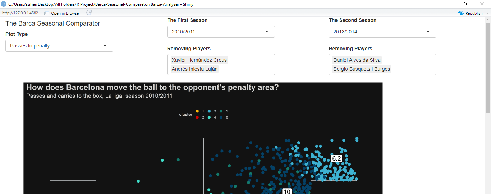

# Barca Seasonal Comparator

"When you play a match, it is statistically proven that players actually have the ball 3 minutes on average … So, the most important thing is what do you do during those 87 minutes when you do not have the ball. That is what determines whether you’re a good player or not." - Johan Cruyff

Actually, this quote has nothing to do with this project, but come on, it's Cruyff talking about statistics!

However, in this project I used the Statsbomb open events data, so even though we can't Know much about players how do not have the ball, we still can know a lot about the overall performance of Barcelona through seasons from 2004/2005 to 2019/2020.

## It is a Data Product
I built a shiny web app to explore the events data for Barcelona in 4 main ways. you can choose one of four plots, two seasons to compare, and you can remove some players to see how the team perform without them and then you can know how much they affected the team.

 

## The Passes to Penalty Plot
It is well known that Barcelona likes possession of the ball, but with that been said, the purpose of keeping the ball is the same purpose of any other tactics in football, create chances and prevent the opponent from creating chances, so this plot will tell you how many times did Barcelona move the ball to the penalty area (by either passes or carries) and from where.

This is a comparison between passes and carries to penalty area in 2010/2011 season and 2014/2015 season

 

You can notice the offensive improvement on the left side for Barca in 2015, also you can see that Barca played more long passes in 2015. It might be surprising but Barca actually was better in attack in 2015 by average 49 ball in the box per match, and only 44 ball per match in 2011. But let’s be honest, who cares about efficiency when he can see tiki-taka?

## The Pressure Plot
You can either close the spaces behind you, or eliminate the opponent time on the ball, and by that, I mean the time from the player received the ball until he decided what to do with it. And as Barcelona likes attack, and leaves a lot of space behind, it is essential to make high pressure after losing the ball so that the opponent can't use the space to threating Barcelona goal. this plot is about where Barcelona applies pressure.

This is a comparison between 2008/2009 season and 2018/2019 season
 

## The Passing Network
The actual reason I made this plot is because it is super cool, However, there are other reasons, you can take many insights from this plot. The passing network consists of two parts, the first is a group of points where each point represented the average location where the player passed or received the ball and it’s size represent the total passes for the player, the second is line segments between the points that it’s size stand for the number of passes between the two players. I added other part for the plot which is a donut chart to see the types of passes for each player.
For this plot I only use the most starting XI and you can’t use the remove players option with this plot.

## The Ball Retaining Plot
I need to say that this is a hard to read plot, maybe I will make an updated version that is easier. Basically, I find every location that Barca lose the ball and attach it with the location where they get the ball back, then I calculated how passes the opponent did before Barca retain possession. To visualize this, I made 20 clusters. You can see what clusters appears most and how fast Barca retain the ball and find patterns.

